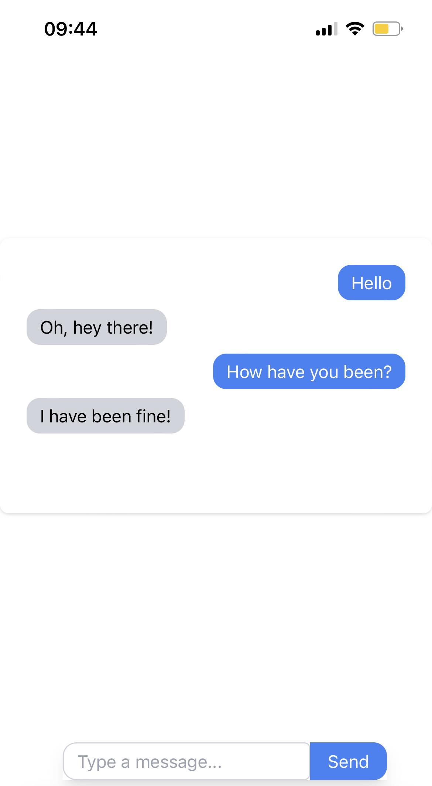

# RizzChat 🚀

RizzChat is a simple and intuitive chat application that allows users to send messages, or as we like to call them, `rizzagges`.



## Features

- Real-time messaging using WebSockets.
- Clean and modern user interface.
- Intuitive chat bubble design to differentiate between sent and received `rizzagges`.
- Built using React for the frontend and FastAPI for the backend.

## Prerequisites

Make sure you have the following installed on your system:

- Node.js
- Python

## Setup & Installation

1. Clone the repository:

   ```bash
   git clone https://github.com/yourusername/rizzchat.git
   cd rizzchat/backend
   pip install -r requirements.txt

